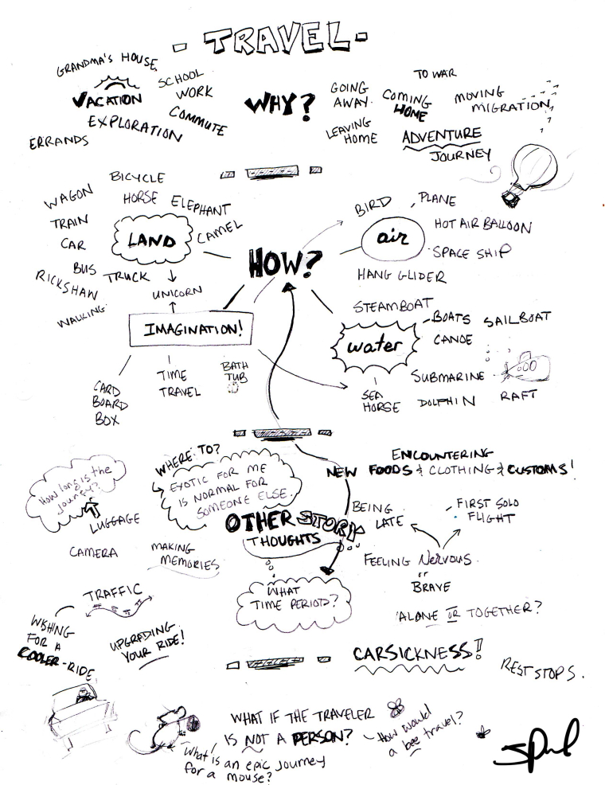
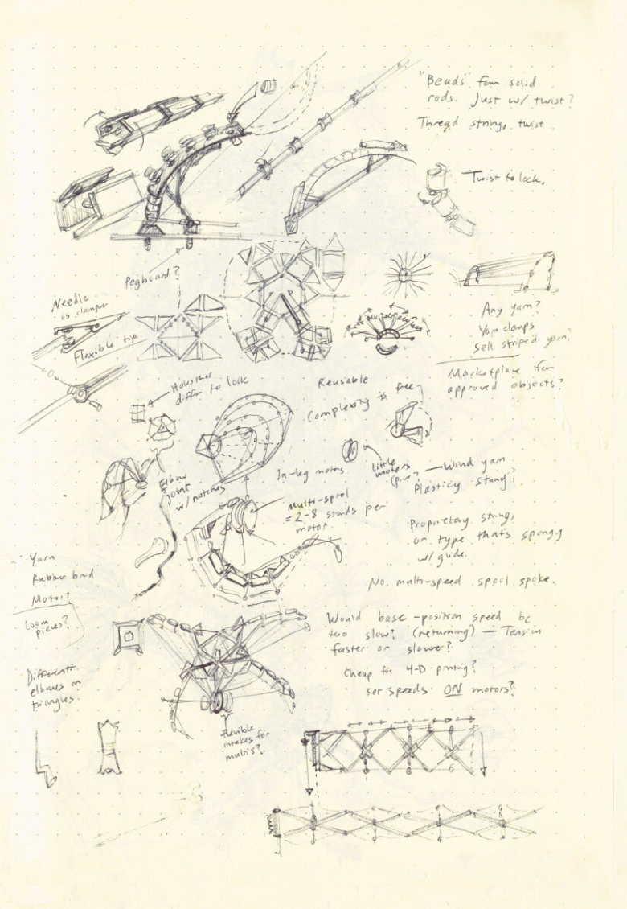

# Final Project

## Description

For your final project, you can make anything you want using Python and VPython. 

You may use code from previous projects, but note that you will be graded only on the code that grows these projects further. You can’t submit the same code twice for credit. 

You can get up to two checkmarks for [each Python coding concept this course evaluates](https://github.com/allegheny-college-cmpsc-100-fall-2023/course-materials#python-fundamentals). In order to get two checkmarks, you must use the concept in two markedly different ways (you can’t just copy the code and change it a little). Your code should have a visible effect on your canvas to receive credit.  

You can also get up to two points for independent research, provided you research and cite two new coding skills that you learn on your own. You need a total of two independent research checkmarks in all of your labs, inluding this project. 

## Deadlines

All deadlines are at 8 pm

| Steps | Deadline | 
| --- | --- | 
| #1-2 References & Brainstorm | November 27 |
| #3 Proposal | November 29 | 
| #4 Working Draft of Code | December 10 | 
| #4-5 final draft of code + reflection | December 18 |

The final project doesn't include a second attempt. No changes will be accepted after December 18. 

## Step One: References

In REFERENCES.md, make a list of five references that really interest you. These could include books, games, songs, films, television shows. They can also include personal stories and experiences that you’ve had.

You should include at least ONE reference that was covered in class discussions. 

Link to these things, screenshot them, and/or describe them. 

This step is due 11/27 at 8PM. 

## Step Two: Brainstorm

Fill an 8.5” X 11” sheet of paper or equivalent tablet screen with writing and/or drawing about ideas you might make for your final project. It might be a good idea to open your references from step one as you work, but it’s up to you! 

Your writing and drawing should be small enough to densely fill the page. Here are some references for the amount of content your brainstorm page should contain. (Note these are references for the AMOUNT of content, not the kind of content):

| | |
| --- | --- |
|  |  |

[comment]: <> (inmage sources: https://www.artstation.com/artwork/18lRKK, https://forum.svslearn.com/topic/5793/travel-brainstorm-sheet )

This step is due 11/27 at 8PM. 

## Step Three: Proposal 

Spend some time looking over your references and brainstorm, and make a decision about your vision for your final project. Write a 200+ word proposal in PROPOSAL.md that addresses the following:

- What you plan to make
- How it will look/feel
- What this idea means to you
- How you will execute this project with Python
- How you will challenge yourself with this project

This step is due 11/29 at 8PM. 

Professor will provide feedback to on-time proposals by the start of class on December 4.

## Step Four: Get Coding

You can use Trinket or VSCode to make your final project. 

To use VSCode, clone this repo and edit your code in `main.py`. After you initially clone your repo, make sure that you run `git pull` after making any changes remotely on Github, otherwise you might have conflicts. You should also commit and push local changes regularly, and before making changes on the remote. 

To use Trinket, create a new VPython Trinket, save it, and paste the share-link in LINK.md. 

**To get credit for a coding concept, include a comment above the relevant code with the concept name in all-caps.** So for **for-loops**, put a comment `# FOR-LOOPS` just above the code your using. If you use a concept more than once, number the instance in the comment (e.g. for math-logic you might use `# MATH-LOGIC 1` and `# MATH-LOGIC 2`). 

**You also must document code thoroughly with comments to get credit.**

In this final project, you can get up to two points each for **variables**, **math-logic**, **while-loops**, **for-loops**, **lists**, **if-else**, **functions**, **return**, **dictionaries**, **classes and methods**. You can also get up to two points for **independent research**. To get a second point for any of these categories, you must use the concept in two distinctly different ways. 

### Independent Research

To get an Independent Rsearch checkmark, you should use VPython and/or Python code we haven't covered in class (see Coding References on the syllabus). You should mark the section of code that you've independently researched with the comment label # INDEPENDENT RESEARCH, and you should explain what each line of the newly-learned code is doing in the comments. 

You should also include a link the the source code you're referencing, and an acknowledgment if you've borrowed any codeblocks more than two lines long (even if you've modified them -- mark your modifications in the comments). You need to get two checkmarks for independent resarch throughout the duration of the semester in order to receive credit. You can receive up to two points in the final project if you have two distinctly different uses of research. 

** An at least partially functioning draft of your code is due December 10 at 8pm. Your final code is due December 18 at 8pm **

## Step Five: Reflection

In order to get a "reflection" checkmark for this lab, write at least two hundred words inside "REFLECTION.md" in which you reflect on your technical and artistic goals and accomplishments with this final project. You will also consider the strengths and weaknesses of Python itself. To receive credit, your response should address each of the following bullet points.

- In what ways did this project meet the goals set out in your proposal? If your project idea changed, that's okay! Just explain those changes here. 
- What would you do to further achieve these goals if you had more time?
- How did your artistic chocies influence the feeling and the meaning of your piece? 
- How did working on this project change your skills as a coder?
- When it comes to Python and VPython, do you feel the language and library are well-designed? Is there anything that could change to make the language more effective? 

Reflection is due December 18 at 8pm. 
